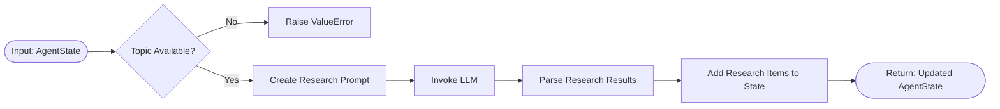

# LinkedIn Post Generation System Flow Diagrams

This document contains detailed flow diagrams that visualize the LinkedIn post generation system's architecture, process flow, and component interactions.

## Main System Flow

The following diagram shows the overall system architecture and workflow:

## Detailed Agent Flows

The following diagrams show the internal logic flow of each agent:

### 1. Topic Selector Agent

### 2. Research Agent

### 3. Hook Generator Agent

### 4. Body Generator Agent

### 5. CTA Generator Agent

### 6. QA Agent

### 7. Final Assembler Agent

## Data Flow Diagram

This diagram visualizes how data flows through the system:

## State Transition Diagram

The following diagram shows how the `AgentState` evolves through the workflow:

